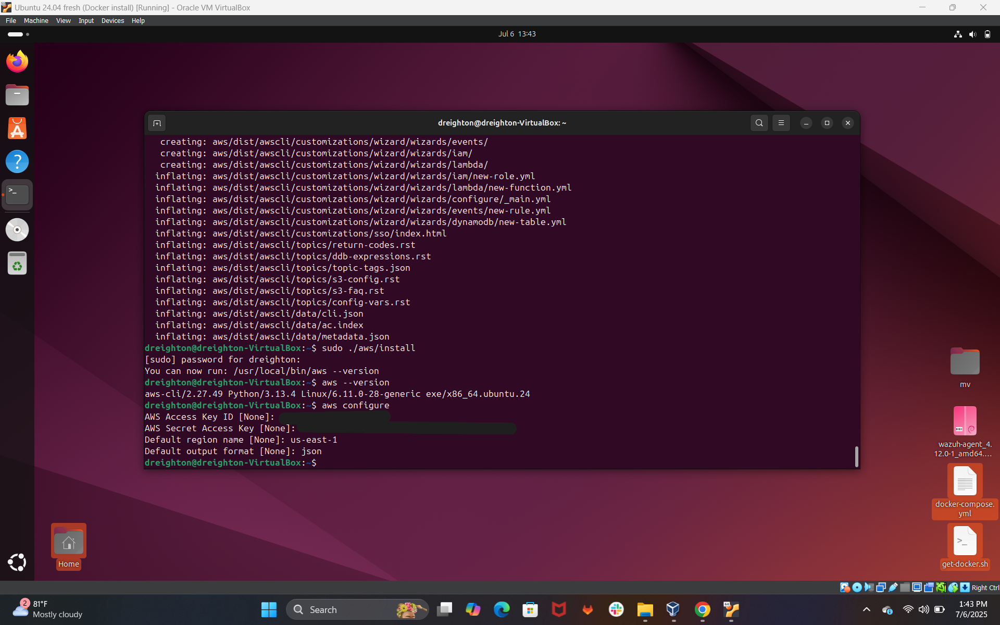

# ☁️ Cloud Security PostgreSQL Lab

This project simulates a real-world SOC Analyst workflow by correlating cloud security events from AWS EC2 with user data and generating actionable security alerts using PostgreSQL. The goal is to demonstrate cloud event visibility, log ingestion, and query-based investigation in a structured lab environment.

---

## 📚 Use Cases

✅ Correlate EC2 actions with user roles and severity levels  
✅ Detect termination or shutdown events from unknown sources  
✅ Simulate SOC workflows with JOIN queries and attribution  

---

## 🧱 Repository Contents

| File              | Description                                                  |
|-------------------|--------------------------------------------------------------|
| `schema.sql`      | SQL for creating `cloud_event_logs`, `users`, and `alerts` tables |
| `seed_data.sql`   | Insert statements for sample cloud events and alerts         |
| `queries.sql`     | JOIN queries to investigate cloud behavior and alert severity |
| `screenshots/`    | Visual walkthrough of key setup, data modeling, and output   |

---

## 🛠️ Technologies Used

- **AWS EC2** (Cloud events source)  
- **CloudWatch + EventBridge** (Log automation and rule generation)  
- **PostgreSQL (AWS RDS)** (Relational database for alert correlation)  
- **Ubuntu 24.04 VM (Jumpbox)** (Querying interface via psql)  
- **Terraform** (Infrastructure as Code for provisioning)

---

## 🧪 Sample Query Output

```sql
SELECT u.username, e.event_type, a.severity
FROM users u
JOIN cloud_event_logs e ON u.user_id = e.user_id
JOIN alerts a ON e.event_id = a.event_id
WHERE a.severity = 'High';

## 📸 Project Walkthrough

  
📌 Preview of `cloud_event_logs` and `users` tables used for alert correlation.

  
📌 Sample `INSERT` statements for seeding test events and users.

  
📌 Combined event query showing user, action, and alert severity.

  
📌 Example of a high-severity EC2 termination alert.

  
📌 JOIN of all three tables with correlated cloud event and user data.

  
📌 User attributes for a Red Team engineer responsible for the event.

  
📌 AWS EC2 instance deployed for PostgreSQL monitoring.

  
📌 Reviewing EC2 security group configurations.

  
📌 Amazon RDS PostgreSQL instance details.

  
📌 Copying RDS endpoint to connect via psql CLI.

  
📌 Successful PostgreSQL login from jumpbox terminal.

  
📌 Tables `users`, `alerts`, and `cloud_event_logs` successfully created.

  
📌 IAM policy to allow logging EC2 events to CloudWatch.

  
📌 Triggering an EC2 shutdown to test logging pipeline.

  
📌 New CloudWatch log group confirming event capture.

  
📌 AWS EventBridge rule set up to forward EC2 stop/terminate events.

  
📌 Log event of EC2 shutdown action written to CloudWatch.

  
📌 PostgreSQL alert raised due to severity + user role mapping.

  
📌 Query executed from hardened Linux jumpbox to validate logs.

  
📌 Inserted second test event to validate alert logic.

  
📌 Terraform successfully deployed PostgreSQL RDS instance.

  
📌 Output from `terraform apply` showing connection info and resources.

  
📌 Adding a second Red Team user to test attribution mapping.

  
📌 Confirming EC2 events visually through CloudWatch dashboards.

  
📌 Final JOIN query showing linked user identity, action, and alert.

  
📌 Query output confirms all relationships and alert triggers function correctly.

