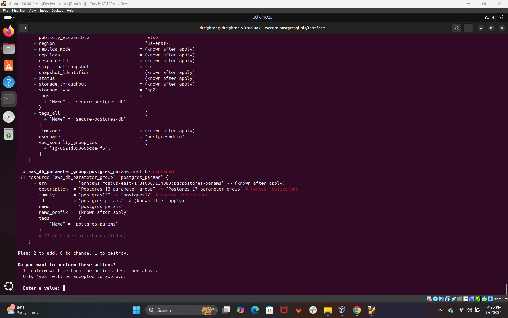

# ☁️ Cloud Security PostgreSQL Lab

This project simulates a real-world SOC Analyst workflow by correlating cloud security events from AWS EC2 with user data and generating actionable security alerts using PostgreSQL. The goal is to demonstrate cloud event visibility, log ingestion, and query-based investigation in a structured lab environment.

---

## 📚 Use Cases

✅ Correlate EC2 actions with user roles and severity levels  
✅ Detect termination or shutdown events from unknown sources  
✅ Simulate SOC workflows with JOIN queries and attribution  

---

## 🧱 Repository Contents

| File              | Description                                                  |
|-------------------|--------------------------------------------------------------|
| `schema.sql`      | SQL for creating `cloud_event_logs`, `users`, and `alerts` tables |
| `seed_data.sql`   | Insert statements for sample cloud events and alerts         |
| `queries.sql`     | JOIN queries to investigate cloud behavior and alert severity |
| `screenshots/`    | Visual walkthrough of key setup, data modeling, and output   |

---

## 🛠️ Technologies Used

- **AWS EC2** (Cloud events source)  
- **CloudWatch + EventBridge** (Log automation and rule generation)  
- **PostgreSQL (AWS RDS)** (Relational database for alert correlation)  
- **Ubuntu 24.04 VM (Jumpbox)** (Querying interface via psql)  
- **Terraform** (Infrastructure as Code for provisioning)

---

## 🧪 Sample Query Output

```sql
SELECT u.username, e.event_type, a.severity
FROM users u
JOIN cloud_event_logs e ON u.user_id = e.user_id
JOIN alerts a ON e.event_id = a.event_id
WHERE a.severity = 'High';
```

---

## 🖼️ Project Walkthrough 

> These screenshots provide a step-by-step visual of the project process.

  
📌 Preview of `cloud_event_logs` and `users` tables used for alert correlation.

  
📌 Sample `INSERT` statements for seeding test events and users.

  
📌 Combined event query showing user, action, and alert severity.

  
📌 Example of a high-severity EC2 termination alert.

  
📌 JOIN of all three tables with correlated cloud event and user data.

  
📌 User attributes for a Red Team engineer responsible for the event.

  
📌 AWS EC2 instance deployed for PostgreSQL monitoring.

  
📌 Review of security group settings for network access.

  
📌 PostgreSQL RDS instance configuration details.

  
📌 Endpoint string used to connect via psql.

  
📌 Terminal confirmation of successful PostgreSQL login.

  
📌 Confirmed creation of custom `cloud_event_logs`, `users`, and `alerts` tables.

  
📌 Policy used to enable CloudWatch event delivery.

  
📌 Manual test trigger for CloudWatch rule validation.

  
📌 Log group creation to store EC2 event activity.

  
📌 AWS EventBridge rule setup preview.

  
📌 Example log for EC2 shutdown detection.

  
📌 Alert generated and stored in `alerts` table.

  
📌 Terminal output from Ubuntu 24.04 Jumpbox querying PostgreSQL.

  
📌 Additional log showing second EC2 termination event.

  
📌 Terraform deployment output confirming successful RDS provisioning.

  
📌 Terraform output values used for connection string and monitoring setup.

  
📌 Inserted new user into `users` table for correlation testing.

  
📌 CloudWatch dashboard monitoring EC2 state transitions.

  
📌 Query results showing user attribution for a system-level event.

  
📌 Final JOIN validation confirming alert, event, and user linkage.
